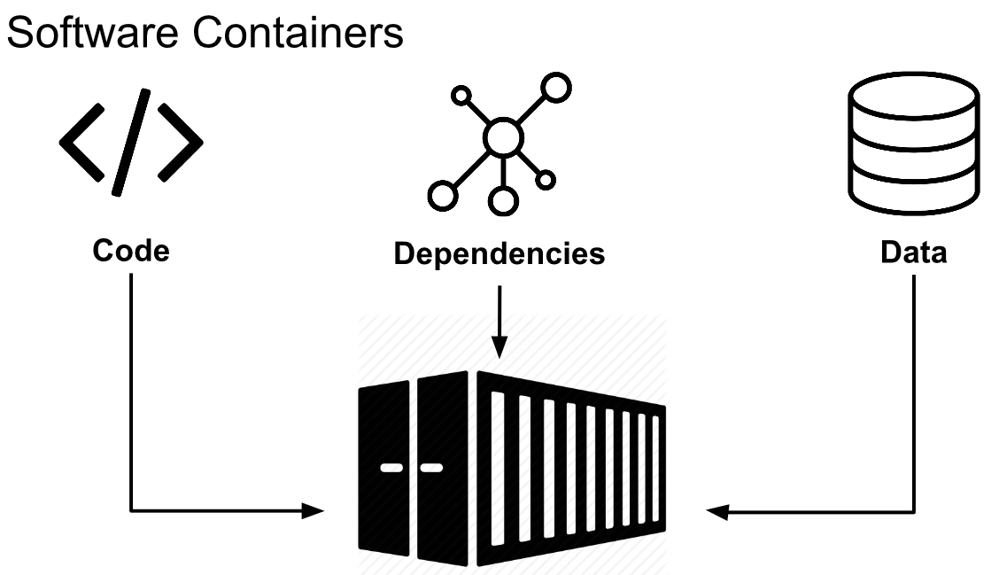
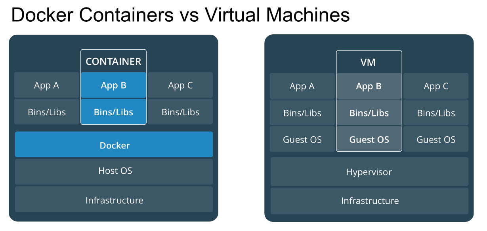
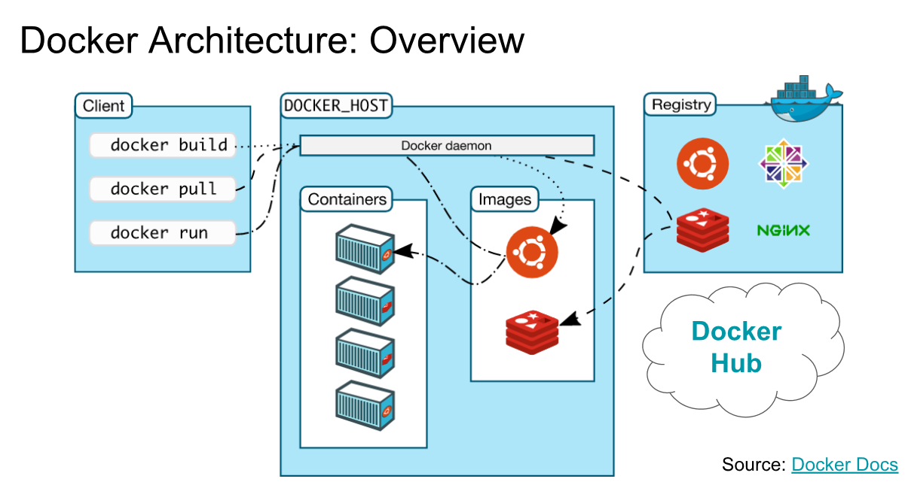
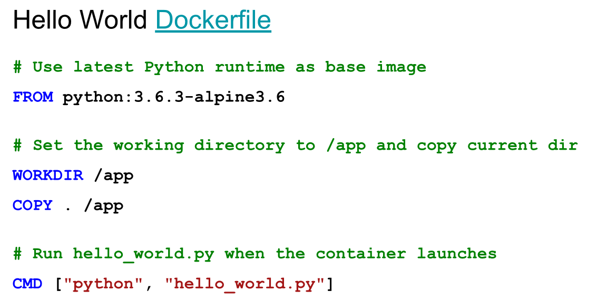

# MyDocker: How to build and use a Docker image for Deep Learning development.

## Problemática

1. If 2 people are working on the same project but with 2 different environments, there may be dependency version issues.
2. Some packages are optimize for a special OS.

## I.	What is Docker
Docker is a manager of container.

Container:

	

•	Isolates app from each other

•	Shares the same kernel – kernel shares resources with the host and interacts with the containers

	

Advantages

•	Quicker to launch (no os to boot)

•	Portability (less dependencies between processed layers)

•	Efficiency

	

	
 
## II.	Run a container

1.	Pull an image from Docker hub: docker login then docker pull <image>
2.	Check the image: docker images
3.	Create a container: docker run –it nom
	Few options:
	
	|INSTRUCTION | SIGNIFICATION |
	|:-----------|:--------------------------------------------|
	|-i|Interactive mode|
	|-p|Publish a container᾿s port or a range of ports to the host format (-p 8888:4000)|
	|-t|Allocate a pseudo-tty|
	|-v path/to/volume|Bind mount a volume|
	
4.	Stop the container: docker stop id container
5.	Interact with a container with shell: docker run –it nom container /bin/bash
6.	Stop the container
7.	Confirm the container has been stop: docker ps –a
8.	Delete the container: docker rm id container

## III.	Build your own container
1.	Create a directory
2.	Create your Dockerfile

Commands:

|INSTRUCTION | SIGNIFICATION |
|:-----------|:--------------------------------------------|
|FROM |	Set base image|
|LABEL	| Add metadata|
|COPY	| Copy files/directories into the image|
|ENV	| Set environment variable|
|EXPORT | Informs Docker that the container listens on the specified network ports at runtime|
|WORKDIR |	Set working directory|
|RUN	| Execute shell commands in a new layer|
|ENTRYPOINT |	Configure container to run as executable|
|CMD	| Provide default for executing container|

Example 

	

3.	Create hello_world.py: print("Hello world!")
4.	Build your image:    docker build –t nom .
5.	Create the container:    docker run nom
6.	Upload to docker hub:    docker login then docker push image

## IV.	Exercise
1.	Create a directory
2.	Create your Dockerfile in this new directory.

    FROM ubuntu:latest
    
    RUN apt-get update && apt-get install -y python3 \
        python3-pip
    
    COPY requirements.txt .

    RUN pip3 install jupyter
    
    RUN pip3 install -r requirements.txt
    
    RUN useradd -ms /bin/bash jupyter
    
    USER jupyter
    
    WORKDIR /home/jupyter
    
    COPY success.txt .
    
    ENTRYPOINT ["jupyter", "notebook", "--ip=*"]

3.	Create requirements.txt with Tensorflow, Keras.
4.	Create success.txt
5.	Build your image: docker build -t jupyter .
6.	Get your image id: docker images
7.	Create a new container: docker run -it -p 8888:8888 image_id /home
8.	Consulte the results on your browser
